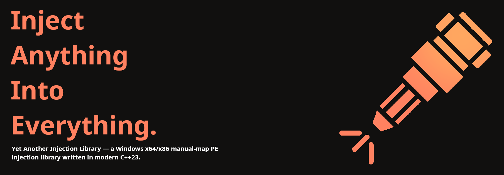

## Features

- Manual PE mapping (no `LoadLibrary` traces)
  - **x64** — full unwind table registration via `RtlInsertInvertedFunctionTable` (with `RtlAddFunctionTable` fallback)
  - **x86** — SEH validation via `RtlInsertInvertedFunctionTable` (handles modern Win11 24H2 internal `__fastcall` convention)
- Maps both **DLLs** and **EXEs** — auto-detected via `IMAGE_FILE_DLL`
  - DLLs invoked as `DllMain(HMODULE, DLL_PROCESS_ATTACH, nullptr)`
  - EXEs invoked as `int __cdecl mainCRTStartup(void)` — works with both `main`-style (console subsystem) and `WinMain`-style (GUI subsystem) entries
- Static TLS via `LdrpHandleTlsData`
- Private `ntdll` routines (`LdrpHandleTlsData`, `RtlInsertInvertedFunctionTable`) resolved from the exact
  loaded image's CodeView RSDS record through the Microsoft symbol server
- TLS callbacks (`.CRT$XLB`)
- Static and delay-loaded imports
- Exception handling (SEH/VEH/C++) compatible with manually-mapped images
- Per-section memory protections (RX, RW, RO, RWX as declared)
- Inject by process ID or process name
- Load from file path or raw bytes in memory
- Returns `std::expected<uintptr_t, yail::Error>` — no exceptions or error-path allocations
- C bindings (`include/yail/yail.h`) returning a `yail_error` status code

## Requirements

- Windows 10 / 11
- Network access to `msdl.microsoft.com` — the matching `ntdll` PDB is downloaded at runtime to resolve
  private symbol RVAs
- C++23 compiler (MSVC recommended)
- CMake 3.28+
- vcpkg

## Building

x64:

```bash
cmake --preset windows-debug-vcpkg
cmake --build cmake-build/build/windows-debug-vcpkg
```

x86:

```bash
cmake --preset windows-debug-vcpkg-x86
cmake --build cmake-build/build/windows-debug-vcpkg-x86
```

Native injection requires matching bitness: an x86 build of yail injects x86 PEs into x86 (WOW64) processes, and an x64 build injects x64 PEs into x64 processes. An x64 build can also inject x86 PEs into x86 targets using its embedded x86 loader.

Examples build by default. Disable with `-DYAIL_BUILD_EXAMPLES=OFF`.

## Usage

### Inject a DLL into a process by name

```cpp
#include <yail/yail.hpp>

auto result = yail::manual_map_injection_from_file("my.dll", "target.exe");

if (!result)
    std::println("Failed: {}", yail::to_string(result.error()));
else
    std::println("Loaded at 0x{:x}", result.value());
```

### Inject by PID

```cpp
auto result = yail::manual_map_injection_from_file("my.dll", GetCurrentProcessId());
```

### Inject an EXE

Same API — auto-detection picks the right entry-point shape:

```cpp
auto result = yail::manual_map_injection_from_file("my.exe", GetCurrentProcessId());
```

EXE caveats (apply to both `main` and `WinMain` flavors):
- When the EXE's entry returns, the CRT calls `exit()` → `ExitProcess`. That terminates the **host** process. If you need the host to survive, the injected EXE must avoid letting `main`/`WinMain` return — e.g. `ExitThread(0)` from the entry, like the bundled `test_exe`.
- `GetModuleHandle(nullptr)` inside the injected EXE returns the **host** image base, not the mapped one. `WinMain`'s `hInstance` is correct (it comes from `__ImageBase`, which is relocated), but APIs that read `PEB->ImageBaseAddress` are not.

### Inject from raw bytes

```cpp
std::vector<uint8_t> bytes = /* ... */;
auto result = yail::manual_map_injection_from_raw(bytes, "target.exe");
```

### Inject x86 from an x64 injector

The normal APIs detect x86 payloads and use the embedded x86 loader automatically. No helper process is launched:

```cpp
auto result = yail::manual_map_injection_from_raw(bytes, "x86-target.exe");
```

## API

```cpp
namespace yail
{
    // Optional post-load hardening, combined with `|`:
    //   yail::manual_map_erase_headers  - zero DOS/NT/section headers after entry returns
    //   yail::manual_map_wipe_imports   - zero import descriptors/names, keep the resolved IAT
    // Both are no-ops for injected EXEs (the EXE entry never returns).

    std::expected<uintptr_t, Error>
    manual_map_injection_from_file(std::string_view pe_path, std::uintptr_t process_id,
                                   std::uint32_t options = 0);

    std::expected<uintptr_t, Error>
    manual_map_injection_from_file(std::string_view pe_path, std::string_view process_name,
                                   std::uint32_t options = 0);

    std::expected<uintptr_t, Error>
    manual_map_injection_from_raw(const std::span<std::uint8_t>& raw_pe, std::uintptr_t process_id,
                                  std::uint32_t options = 0);

    std::expected<uintptr_t, Error>
    manual_map_injection_from_raw(const std::span<std::uint8_t>& raw_pe, std::string_view process_name,
                                  std::uint32_t options = 0);
}
```

On success, returns the base address of the mapped image in the target process. On failure, returns a stable
`yail::Error` code. Pass it to `yail::to_string` when a human-readable description is needed.

The returned address is not a loader-managed `HMODULE`. A DLL mapped by yail is absent from the Windows loader module list, so passing that address to `FreeLibrary` or `FreeLibraryAndExitThread` is invalid. yail does not currently provide manual unmapping. A mapped DLL must stop its work and return, or be loaded with `LoadLibrary` when OS-managed unload is required.

### C API

`include/yail/yail.h` exposes the same functionality to C. Since C has no
overloading, the process-name variants carry a `_by_name` suffix, and the mapped
base address is written through an out-parameter. Every function returns a
`yail_error` status where `YAIL_ERROR_SUCCESS` (`0`) means success; pass it to
`yail_error_to_string` for a description.

```c
#include <yail/yail.h>

uintptr_t base = 0;
yail_error status = yail_manual_map_injection_from_file("my.dll", GetCurrentProcessId(), 0, &base);
if (status != YAIL_ERROR_SUCCESS)
    printf("Failed: %s\n", yail_error_to_string(status));
```

Raw bytes use `yail_manual_map_injection_from_raw(const uint8_t* raw_pe, size_t raw_pe_size, ...)`,
and the name-based variants are `yail_manual_map_injection_from_file_by_name` and
`yail_manual_map_injection_from_raw_by_name`.

### Anti-dump hardening

Pass a combination of the option flags as the final `options` argument to make the mapped image harder
to dump after initialization:

```cpp
auto result = yail::manual_map_injection_from_file(
        "my.dll", "target.exe",
        yail::manual_map_erase_headers | yail::manual_map_wipe_imports);
```

- `manual_map_erase_headers` zeroes the DOS/NT/section headers once the entry point returns, so a dumper
  can't recover the on-disk PE header structure from memory.
- `manual_map_wipe_imports` zeroes the import descriptors and the module/symbol name tables while keeping
  the resolved IAT, defeating import-reconstruction-based dumpers.

Both run after `LoadLibrary`-time initialization, are **off by default**, and are no-ops for injected EXEs
(their entry never returns). They are irreversible: a hardened DLL can no longer self-query its headers or
resolve imports reflectively, and delay imports are intentionally left intact.

### Themida compatibility

Protect DLLs intended for manual mapping with this Themida Option:

```text
Anti-File patching must me OFF
```


## CMake Integration

```cmake
find_package(yail CONFIG REQUIRED)
target_link_libraries(my_target PRIVATE yail::yail)
```

## Examples

The `examples/` directory contains:

| Target          | Purpose                                                                                |
|-----------------|----------------------------------------------------------------------------------------|
| `loader`        | Manual-maps a PE (DLL or EXE) into the current process. `loader.exe <path>`.           |
| `remote_loader` | Manual-maps into a target process by name. `remote_loader.exe <dll> <process.exe>`.    |
| `test_dll`      | Self-test DLL exercising TLS, SEH, C++ exceptions, delay imports, threading, vtables.  |
| `test_exe`      | Same battery of tests, but as a console-subsystem EXE entered via `main()`.            |
| `test_winexe`   | GUI-subsystem EXE entered via `WinMain` — verifies `hInstance`, `lpCmdLine`, `nShowCmd`. |

Quick verification on either bitness:

```bash
loader.exe test_dll.dll       # 23 tests
loader.exe test_exe.exe       # 16 tests + ExitThread keeps the loader alive
loader.exe test_winexe.exe    # WinMain path + GUI subsystem checks
```

## Symbol resolution

The library locates two non-exported ntdll routines:

- `LdrpHandleTlsData` — used to register static TLS for the mapped image
- `RtlInsertInvertedFunctionTable` — used to make the image's exception/SEH handlers visible to the OS exception dispatcher

Both are resolved from the PDB that matches the exact loaded `ntdll.dll`. YAIL reads the image's CodeView `RSDS` record for the PDB file name, GUID, and age, downloads that PDB from the Microsoft public symbol server, and parses the symbol stream for the two RVAs. There is no signature-scan fallback: the runtime requires network access to `msdl.microsoft.com`, and a failed or mismatched download is a hard error.

For WOW64 targets, the same RSDS lookup is performed against the 32-bit `ntdll.dll` read out of the target process. On modern x86 ntdll, both functions use `__fastcall` (args in `ECX`/`EDX`) despite their legacy `_Name@N` symbol decoration — the typedef and call sites in the source reflect that. If you target an older x86 Windows where these are still `__stdcall`, you'll need to swap the typedef to `NTAPI*`.

The shellcode implementation used for generation lives in `tools/generate_shellcode.cpp`. After changing it, rebuild both `generate_shellcode` targets and refresh `source/shellcode.cpp`:

```bash
cmake-build/build/windows-release-vcpkg/generate_shellcode.exe
cmake-build/build/windows-release-vcpkg-x86/generate_shellcode.exe
```

## License

[Zlib](LICENSE)
